# Screens and States

Every screen in Noto, every state it can be in, with a captured screenshot as ground truth.

State IDs (`LIST-01`, `EDIT-08`, …) are stable and referenced by
[03-uat-checklist.md](03-uat-checklist.md). Screenshots live in `screenshots/<platform>/<ID>.png`.

Accessibility identifiers are listed per control — they are the app's existing test surface
and the RN build should preserve them so the Maestro flows in `.maestro/` keep working.

---

## 1. Vault setup

First-launch flow. Shown whenever `VaultLocationManager.isVaultConfigured` is false —
on first run, and again after **Change Vault** in Settings.

### VAULT-01 — Welcome

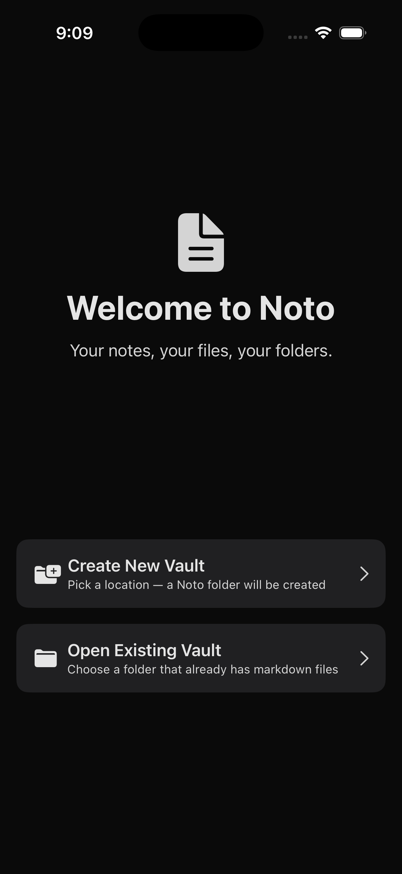

Centred document icon, "Welcome to Noto", subtitle "Your notes, your files, your folders.",
and two stacked action cards pinned toward the bottom.

| Control | ID | Behaviour |
|---|---|---|
| Create New Vault | `create_vault_button` | Picks a **parent** location; a `Noto` folder is created inside it |
| Open Existing Vault | `open_vault_button` | Picks a folder that already contains markdown |

The two cards differ only in subtitle and icon — the distinction (create-inside vs. use-as-is)
is carried entirely by copy, so the RN version must keep both subtitles.

### VAULT-02 — Folder picker

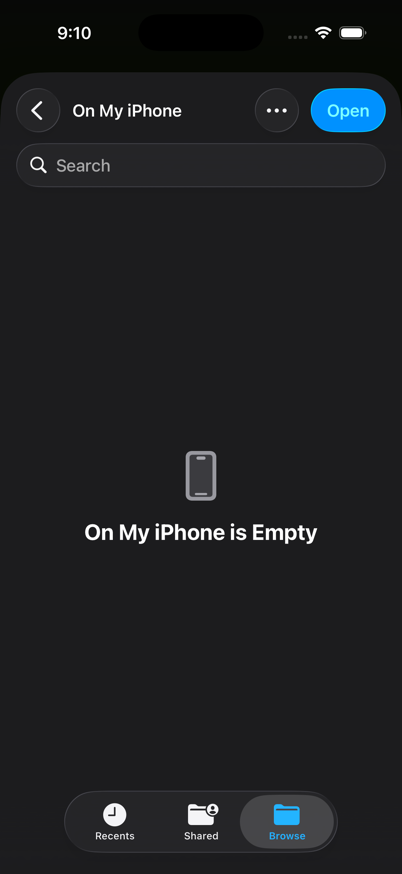

iOS presents `UIDocumentPickerViewController` scoped to `.folder`, opening at the app's
Documents directory. macOS presents `NSOpenPanel` with `canChooseDirectories = true` and a
mode-specific prompt ("Create Here" vs. "Open").

This is a **system surface with no RN equivalent** — see
[04-migration-risks.md](04-migration-risks.md#security-scoped-access).

---

## 2. Note list / sidebar

The vault browser. On iPhone it is the root screen of a `NavigationStack`; on iPad and macOS
it is the sidebar column of a `NavigationSplitView`.

### LIST-01 — Root, populated

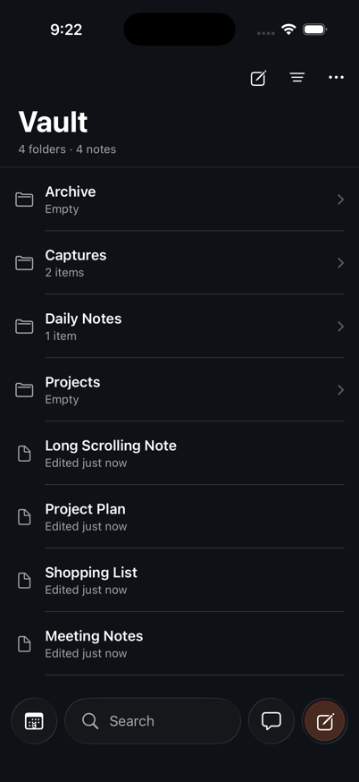

Large title `Vault` with a subtitle counting contents (`4 folders · 4 notes`, id
`largeTitleHeader`). Folders sort above notes; both groups sort by the active sort key.

| Row type | ID pattern | Subtitle |
|---|---|---|
| Folder | `folder_<name>` | `Empty`, `1 item`, or `N items` — counts **all** children, not just notes |
| Note | `note_<title>` | Relative edit time — `Edited just now`, `Edited 2 minutes ago` |

Folder rows have a trailing chevron; note rows do not. The whole list is `note_list`.

**Top bar:** `new_note_button`, `sort_menu`, `more_menu`.
**Bottom dock** (floating, translucent): `today_button`, `search_button` (a wide pill reading
"Search"), `chat_button`, `new_root_note_button` (accented circle).

Note the count asymmetry: the header says "4 folders · 4 notes" while a folder row says
"2 items". Header counts are typed; row counts are not.

### LIST-02 — Sort menu

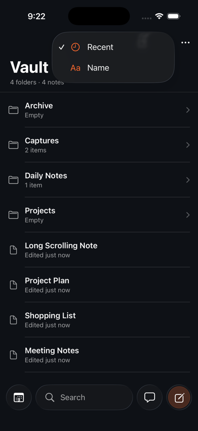

Two options with a checkmark on the active one: **Recent** (clock icon) and **Name**
(`Aa` icon). Default is Recent. Applies to folders and notes independently within their groups.

### LIST-03 — More menu

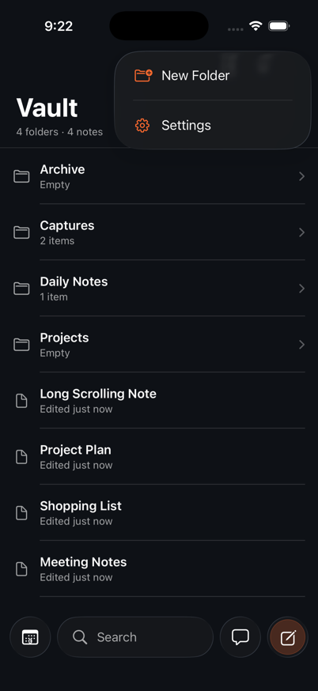

**New Folder** (`new_folder_button`) and **Settings** (`settings_button`).

### LIST-04 — New folder alert

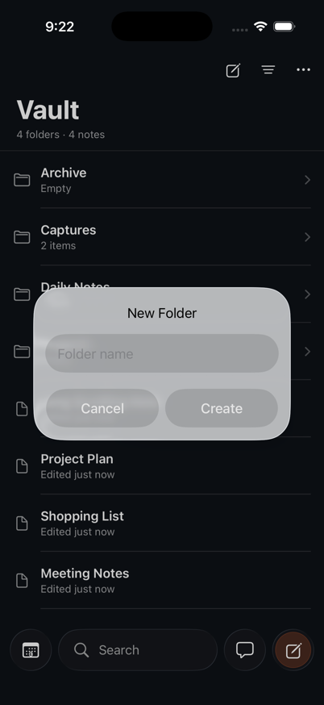

A text-field alert titled "New Folder" with **Cancel** and **Create**. Create is a no-op on
an empty name.

### LIST-05 — Empty folder

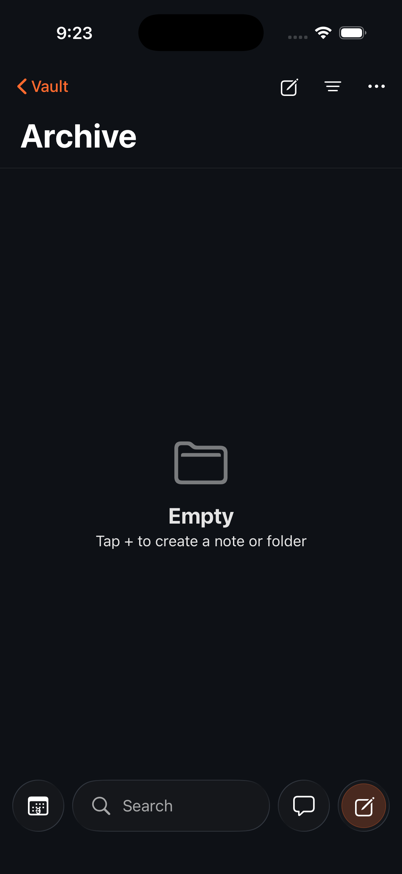

`ContentUnavailableView` — folder icon, title **Empty**, description
"Tap + to create a note or folder". The back button is labelled with the parent folder's
name (`Vault`), not a generic "Back".

### LIST-06 — Populated folder

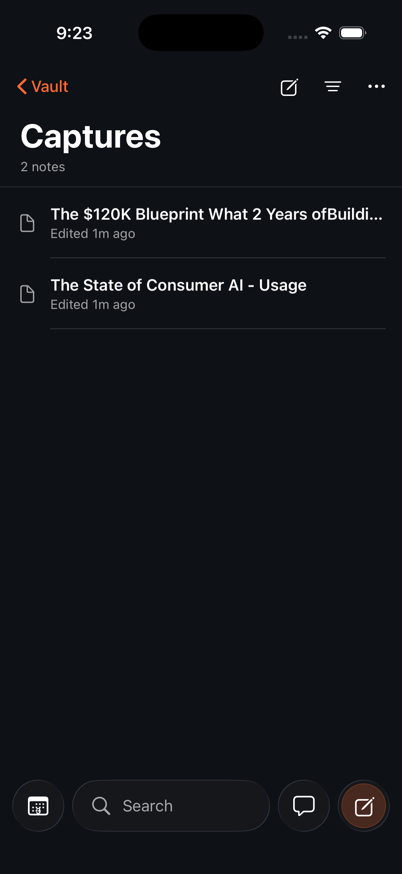

Same structure as root. Header subtitle switches to a note-only count (`2 notes`) because the
folder contains no subfolders.

---

## 3. Editor

`TextKit2EditorView` — the heart of the app and the hardest part to migrate. Markdown is
rendered **live and in place**: syntax markers stay visible in the text, styled to recede,
while the content they mark is styled up.

### EDIT-01 — Headings and paragraphs

`#` and `##` markers render in a muted grey at the same size as their heading; heading text
is bold white and scales with level. Paragraphs are body-weight with generous leading.
Vertical rhythm is asymmetric — more space above a heading than below it.

**The markers are real characters in the buffer**, not decoration. Caret movement, selection,
and hit testing all traverse them.

### EDIT-08 — Todos

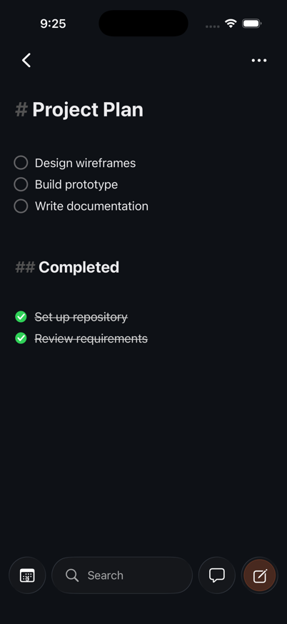

The single most distinctive rendering rule. `- [ ] ` is replaced by a hollow circle glyph;
`- [x] ` by a filled green check, and its text is struck through and dimmed.

The backing markdown is unchanged — the replacement is a visual attribute over live text.
`CLAUDE.md` calls out the constraint explicitly: the insertion boundary next to the glyph
must keep **body-font metrics** so caret, selection rects, hit testing, wrapping, and overlay
placement stay stable. Regression tests must cover the *empty-content* boundary
(`- [ ] ` with nothing after it), not only the populated case.

Toggling is available three ways: tapping the circle, the `toggle_todo_button` accessory, and
editing the markdown directly.

### EDIT-09 — Bullets

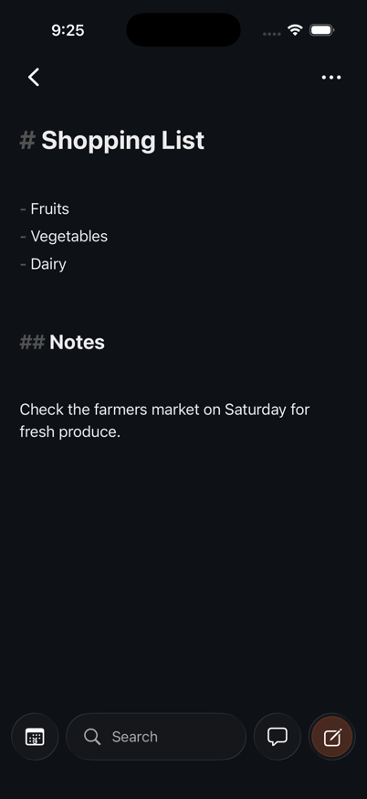

`- ` renders as a muted dash marker with the text indented past it. Wrapped lines hang to the
text indent, not back to the marker — visible in `EDIT-10`.

### EDIT-10 / EDIT-11 — Long note, top and scrolled

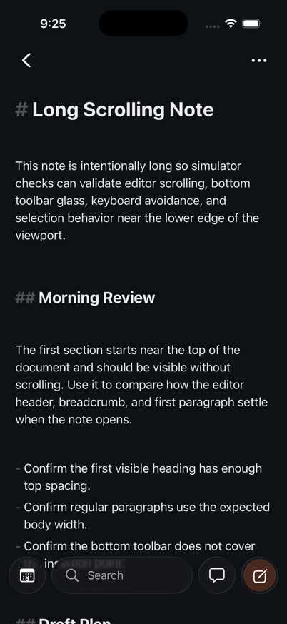
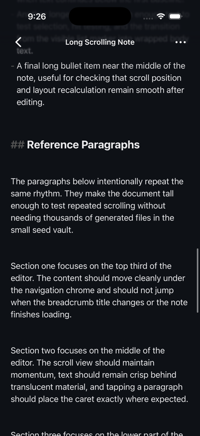

At the top: no nav-bar title, dock visible. Once scrolled past the H1, the note title appears
inline in the nav bar (`editor_scrolled_title`) and the **bottom dock hides**
(`dockHiddenByScroll`). Content scrolls under translucent top chrome.

### EDIT-12 — Capture note (links, quotes, comments, images)

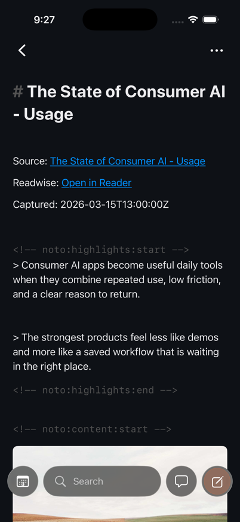

The densest rendering state:

- **Markdown links** render as blue link text showing the *title*; the URL is hidden while the
  caret is elsewhere. Placing the caret on the line reveals the raw markdown.
- **HTML comments** (`<!-- noto:highlights:start -->`) render in muted monospace — they are
  structural markers for Readwise sync and must stay visible and editable.
- **Blockquotes** keep a literal `>` prefix and render at body weight.
- **Images** load inline from the vault-relative path.
- The dock becomes visibly translucent over image content.

### EDIT-01b — New empty note

A new note opens with `# ` pre-inserted, the caret after it, and the accessory toolbar raised.
The title is derived from the first line, so typing immediately names the file.

**Keyboard accessory toolbar** (iPhone/iPad only, left to right):

| Control | ID |
|---|---|
| Toggle Todo | `toggle_todo_button` |
| Indent | `indent_button` |
| Outdent | `outdent_button` |
| Strikethrough | `toggle_strikethrough_button` |
| Link | `toggle_hyperlink_button` |
| Insert Image | `insert_image_button` |
| Hide Keyboard | `hide_keyboard_button` (right-aligned, separated) |

### EDIT-02 — Editor more menu

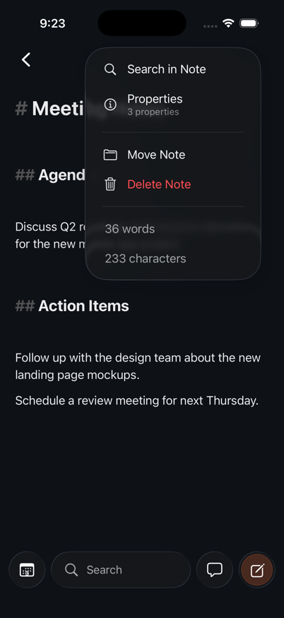

| Item | ID |
|---|---|
| Search in Note | `search_in_note_menu_item` |
| Properties (subtitle: "N properties") | `properties_menu_item` |
| Move Note | `move_note_menu_item` |
| Delete Note (destructive red) | `trash` |
| "36 words" (non-interactive) | `editor_word_count_menu_item` |
| "233 characters" (non-interactive) | `editor_character_count_menu_item` |

Counts are computed on a debounced background task and exclude frontmatter.

> **`CLAUDE.md` warns:** this menu is implemented **separately** for iOS/iPadOS and macOS.
> Changing one does not change the other. The RN migration should unify it.

### EDIT-03 / EDIT-04 — Find in note

A pill-shaped bar docked at the bottom, above the keyboard when raised.

- Current match highlights **yellow**; other matches highlight **grey**.
- Counter reads `1 / 2` (`editor_find_count`).
- Controls: `editor_find_search_field`, `editor_find_previous_button`,
  `editor_find_next_button`, `editor_find_close_button` ("Done").
- Opening find hides the bottom dock.

### EDIT-07 — Properties (iPhone: bottom sheet)

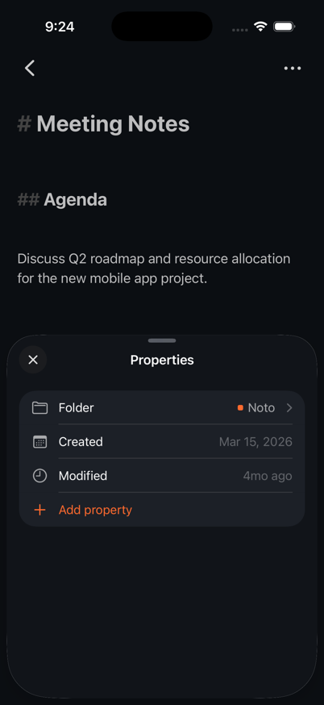

Bottom sheet with a grabber, circular ✕ close, and centred "Properties" title.

| Row | ID | Notes |
|---|---|---|
| Folder | `property_row_folder` | Accented dot + folder name, chevron → opens move picker |
| Created | `property_row_created` | Date only |
| Modified | `property_row_modified` | Relative (`1m ago`, `4mo ago`) |
| Updated | `property_row_updated` | Date + time; only present when frontmatter has it |
| Add property | `add_property_button` | Accented `+` |

Rows are frontmatter-backed — `Updated` appears only for notes that carry it (capture notes do).

### EDIT-04b — Add property menu

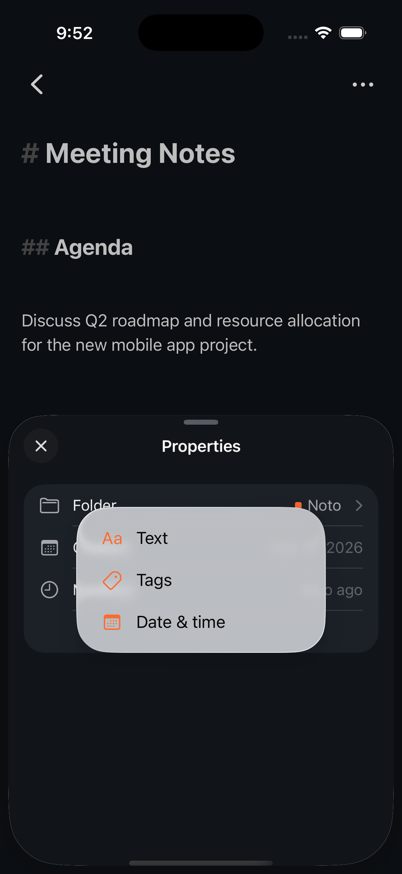

Three types: **Text** (`property_type_text`), **Tags** (`property_type_tags`),
**Date & time** (`property_type_date`).

### EDIT-05 — Move note

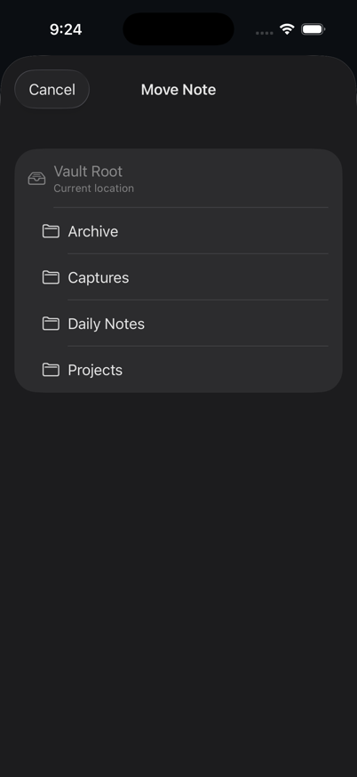

Sheet titled "Move Note", **Cancel** at leading (`move_note_cancel_button`). Destinations are
every folder plus **Vault Root**, each `move_destination_<name>`. The current location is
annotated "Current location". Empty vault → `ContentUnavailableView("No folders")`.

### EDIT-06 — Delete confirmation

`confirmationDialog` titled "Delete this note?" with destructive **Delete Note** and
**Cancel**. On iPhone it renders as a popover anchored to the menu.

---

## 4. Search

A modal sheet on iOS. Backed by FTS5 keyword search **fused with semantic (embedding) search**.

### SEARCH-01 — Recent (empty query)

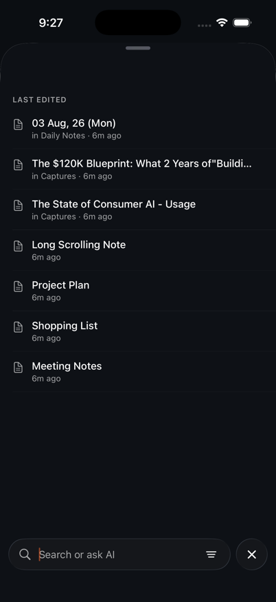

Section header `LAST EDITED`, rows `note_search_result_<index>`. The dock reads
"Search or ask AI" (`note_search_query_field`).

### SEARCH-02 — Results

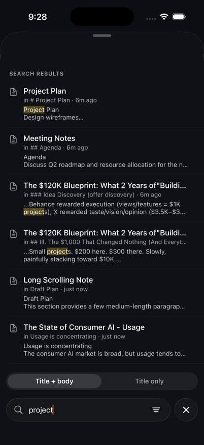

Header switches to `SEARCH RESULTS`. Each row carries four lines:

1. Note title
2. Breadcrumb + relative time — `in ## Agenda · 6m ago` (the **matched heading**, or the
   filename when the match is in the title)
3. The matched section heading
4. Snippet with the query term highlighted in yellow

A note can appear **multiple times** with different matched sections — visible in the
screenshot where one capture note returns two rows.

A segmented control appears once a query exists: **Title + body** / **Title only**
(`search_segmented_control`).

### SEARCH-03 — Title-only scope

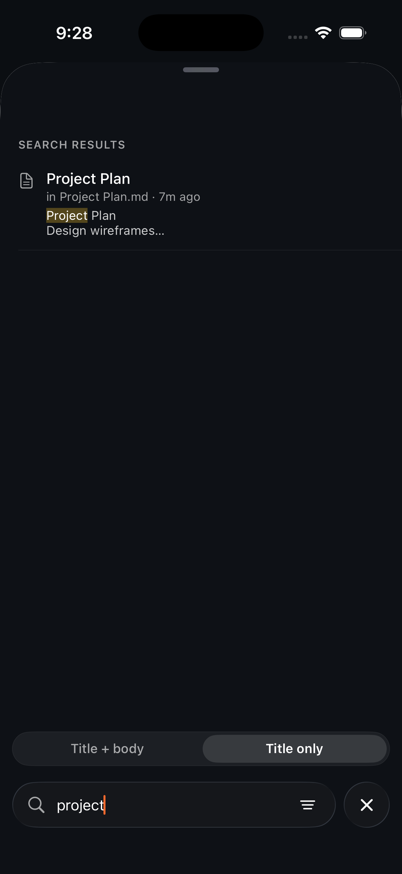

Switching to **Title only** restricts matching to note titles. Rows lose the body snippet and
the result set narrows accordingly.

### SEARCH-04 — Semantic fallback

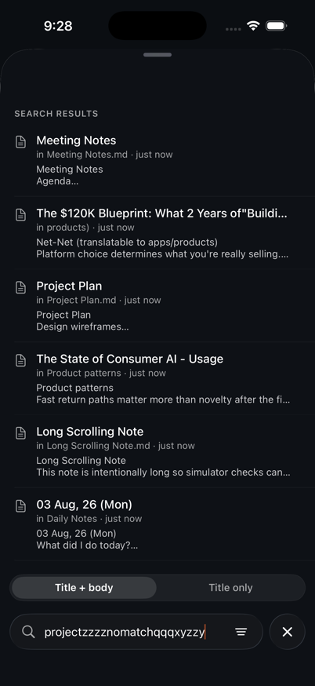

**Important behavioural quirk.** Because results fuse keyword and semantic search, a query
with no lexical match still returns semantically-nearest notes rather than an empty state.
The screenshot shows the nonsense query `projectzzzznomatchqqqxyzzy` returning six notes with
no highlighted terms.

`ContentUnavailableView` for empty results exists in the code but is effectively unreachable
once the semantic index is warm. **The RN version must replicate the fusion**, or search will
feel materially worse — this is not a state to "fix".

### SEARCH-05 / SEARCH-06 — Tag mode

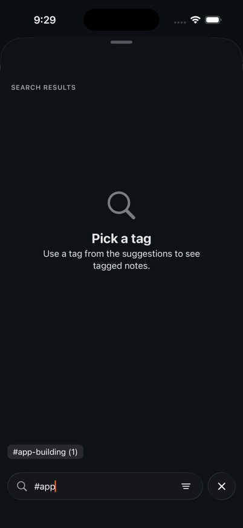
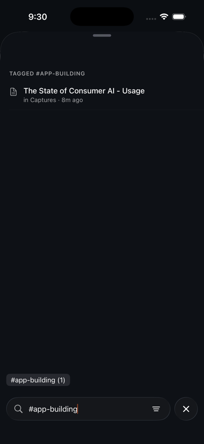

Typing `#` at the **start** of the query switches modes:

- The scope segmented control is replaced by a **tag suggestion strip**
  (`tag_search_suggestion_<index>`), each chip showing name and count — `#app-building (1)`.
- Until a tag is picked: `ContentUnavailableView` "Pick a tag" / "Use a tag from the
  suggestions to see tagged notes."
- After picking: header becomes `TAGGED #APP-BUILDING` and lists member notes.

Other documented states not captured: `Indexing notes` (during index build),
`Searching notes` (query in flight, no results yet), and
`Search Unavailable` (vault load failure).

---

## 5. AI chat

### CHAT-01 — Empty composer

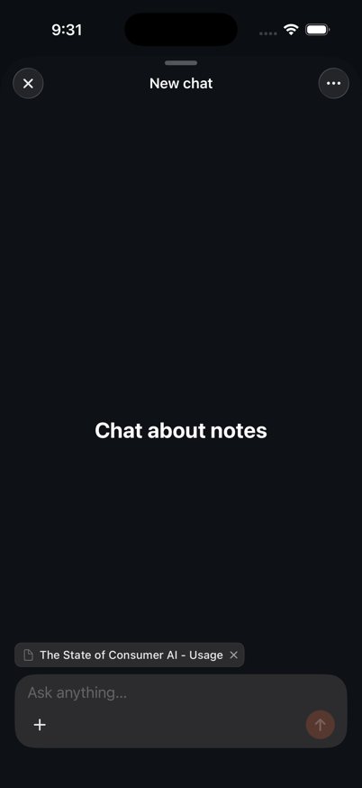

Full-height sheet. Header: circular ✕ (`chatSheet.close`), title "New chat"
(`chatSheet.title`), ⋯ (`chatSheet.more`). Empty state reads "Chat about notes".

The composer auto-attaches **the currently open note** as a context chip
(`composer.mentionTag.<path>`) with its own ✕. Below: `composer.field` ("Ask anything…"),
`composer.attach` (+), `composer.send` (accented ↑).

Without an OpenRouter key, sending surfaces an alert directing the user to Settings.
Related surfaces documented but not captured: `AddContextSheet`, `ChatHistorySheet`,
`EditBlockView` (accept/dismiss AI edits), tool-step and sources rendering.

---

## 6. Settings

### SET-01 — Top

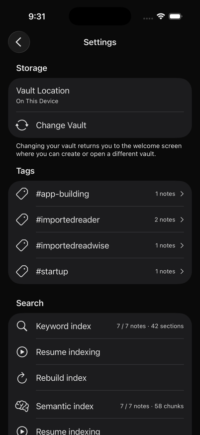

- **Storage** — Vault Location (`On This Device` / path), **Change Vault** (destructive).
  Footer explains it returns you to the welcome screen.
- **Tags** (`settings_tags_section`) — one row per tag with note count
  (`tag_row_<name>`), or "No tags yet — add tags to a note to see them here."

### SET-03 — Search index

Separate status and controls for the **keyword index** (`keyword_index_status`) and the
**semantic index** — each with **Resume indexing** and **Rebuild index**.

### SET-02 — AI Chat, Advanced, Readwise

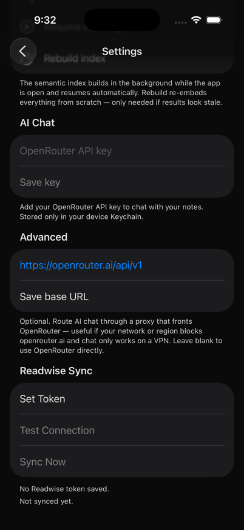

- **AI Chat** — `settings.openRouterKey`, `settings.saveOpenRouterKey`. Footer: "Stored only
  in your device Keychain."
- **Advanced** — `settings.openRouterBaseURL` (default `https://openrouter.ai/api/v1`),
  `settings.saveOpenRouterBaseURL`. For proxying around region blocks.
- **Readwise Sync** — Set Token / Test Connection / Sync Now. Test and Sync are **disabled
  until a token exists**; the footer reads "No Readwise token saved. / Not synced yet."

---

## 7. Daily notes

### DAILY-01 — Today

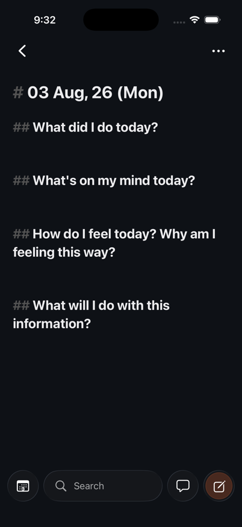

`today_button` (⌘T, and the `Noto ▸ Today` menu item) opens today's note, creating it from a
template if missing. Filename is `YYYY-MM-DD.md` in `Daily Notes/`; the H1 renders as
`03 Aug, 26 (Mon)`.

The template pre-populates four H2 prompts: *What did I do today?* / *What's on my mind
today?* / *How do I feel today? Why am I feeling this way?* / *What will I do with this
information?*

`DailyNotePrewarmer` creates it ahead of time on launch, on foreground, and on a scheduled
midnight rollover — so the note usually already exists.

---

## 8. iPad deltas

iPad shares all logic with iPhone. Only presentation differs.

### IPAD-01 / IPAD-02 — Sidebar overlay

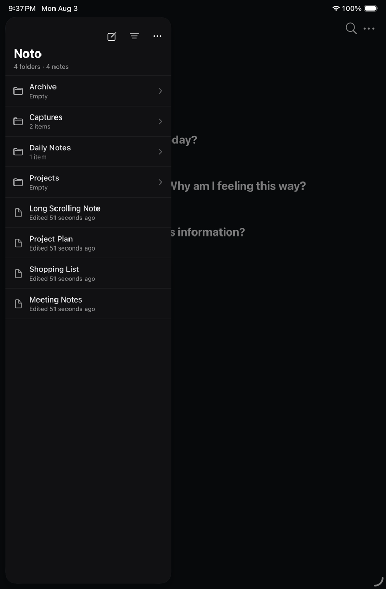
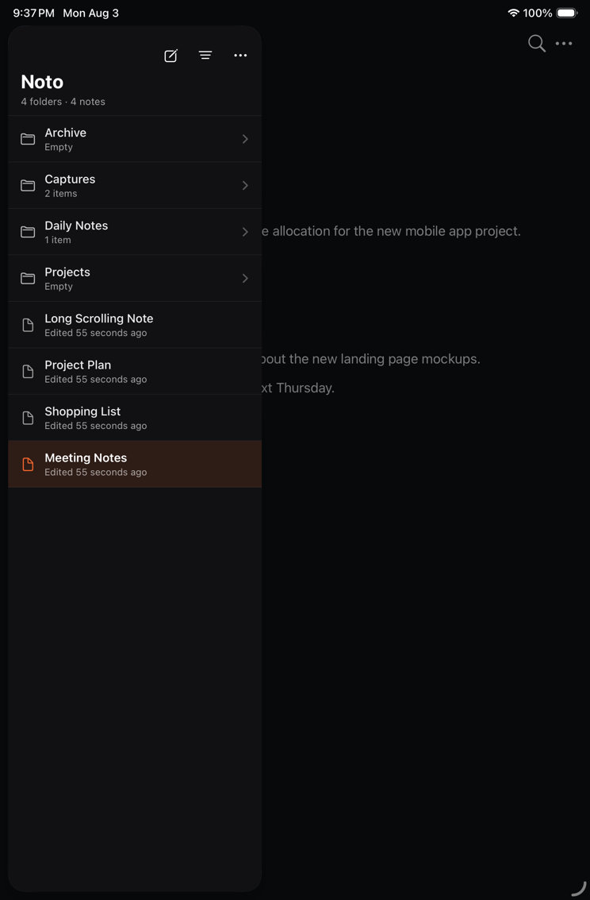

On iPad mini in portrait the sidebar is an **overlay above the detail**, not a permanent
column. The selected note is highlighted with an accented background and accented icon —
**selection state that does not exist on iPhone**, where navigation is push-based.

Sidebar controls take a `sidebar_` prefix: `sidebar_back_button`, `sidebar_new_note_button`,
`sidebar_sort_menu`, `sidebar_more_button`.

### IPAD-03 / IPAD-12 — Detail and the compact dock

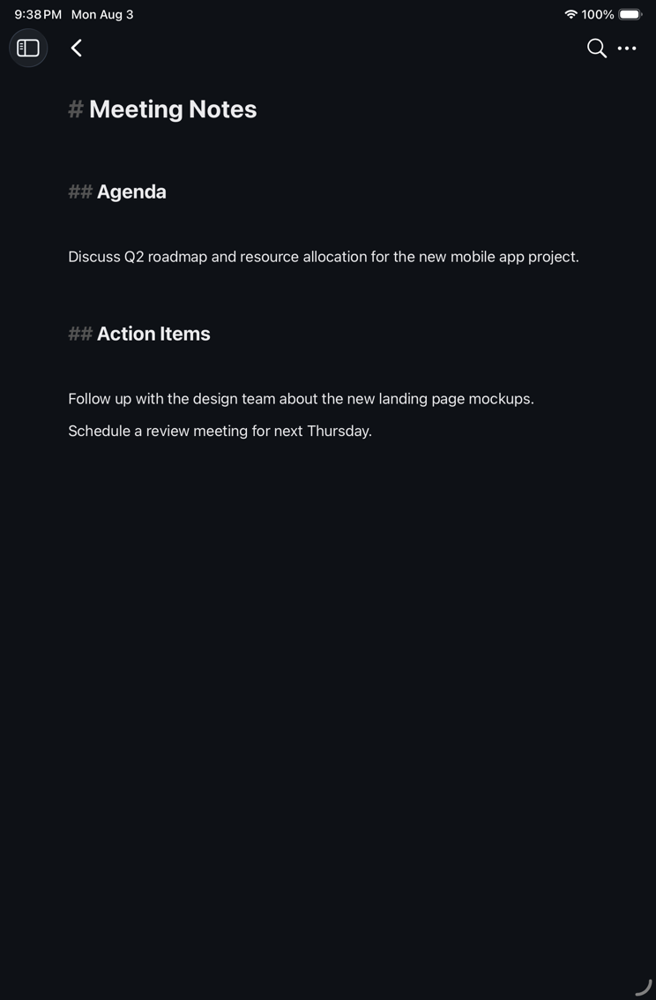
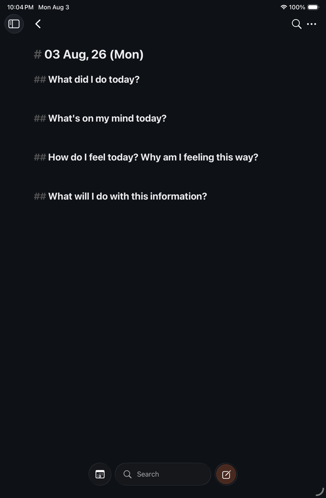

Top bar: `sidebar_toggle_button`, back, search, more.

The bottom dock **is present** in the iPad editor, but it is laid out differently: at regular
width it renders as a **centred, compact dock with a fixed-width search pill**, where iPhone
stretches the pill to full width. It also carries only three controls —
`today_button`, `search_button`, `new_root_note_button`.

**There is no `chat_button` in the iPad dock.** Chat is reached from the sidebar More menu
instead (see IPAD-07/IPAD-08) — the same action, a different entry point.

### IPAD-07 — Sidebar more menu

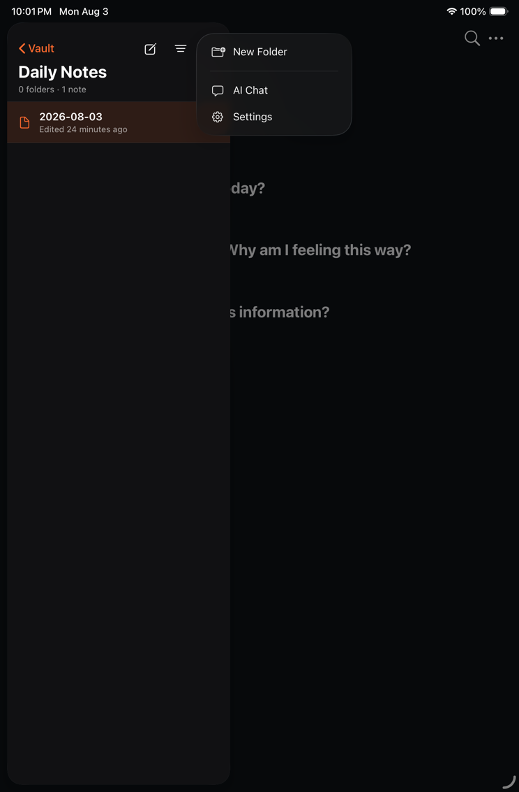

Three items, one more than iPhone's list More menu:

| Item | ID |
|---|---|
| New Folder | `sidebar_new_folder_button` |
| **AI Chat** | `sidebar_chat_button` |
| Settings | `gearshape` |

This is the only route to chat on iPad.

### IPAD-08 — Chat as an inset form sheet

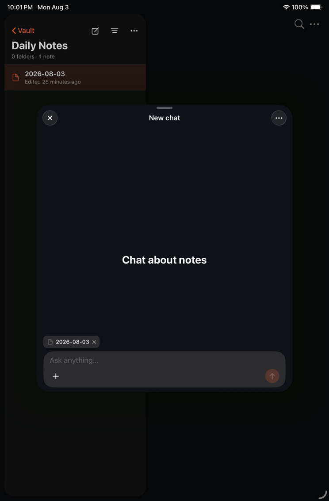

**A real presentation delta, not a re-skin.** On iPhone the chat sheet is full-height with
`.presentationDetents([.large])`. On iPad it presents as an **inset form sheet** — a floating
rounded card, roughly centred, that leaves the sidebar and part of the editor visible around it.

Contents and identifiers are otherwise identical to `CHAT-01`, including the auto-attached
context chip for the open note.

### IPAD-09 — Settings as an inset form sheet

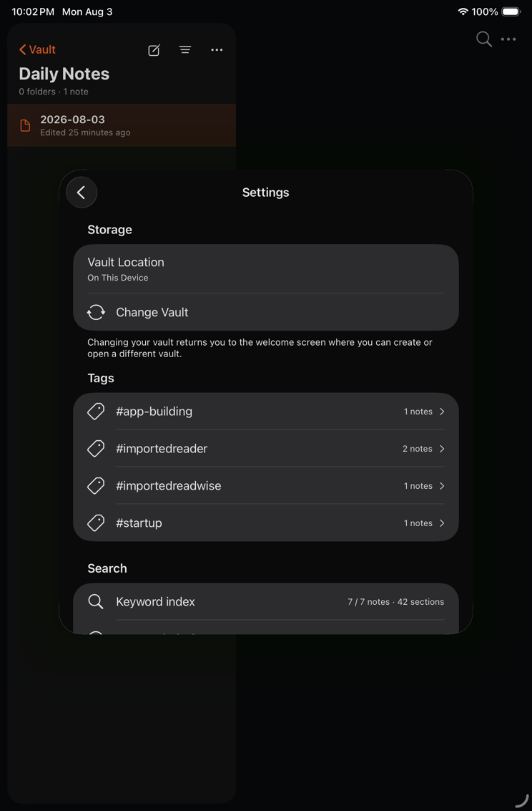

Same inset presentation. Two differences from iPhone worth carrying:

- Dismissal is a **leading back chevron**, where iPhone uses a trailing **Done** button.
- Tag rows show trailing chevrons and are navigable.

This capture also shows the keyword index in a real populated state —
`Keyword index · 7 / 7 notes · 42 sections`.

### IPAD-10 / IPAD-11 — Search as a page sheet

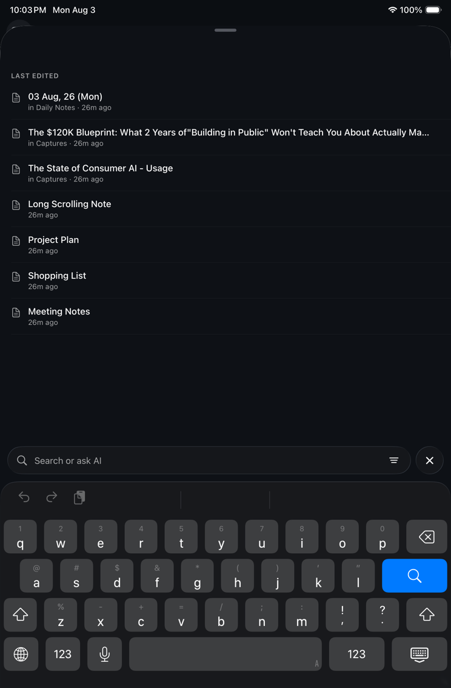
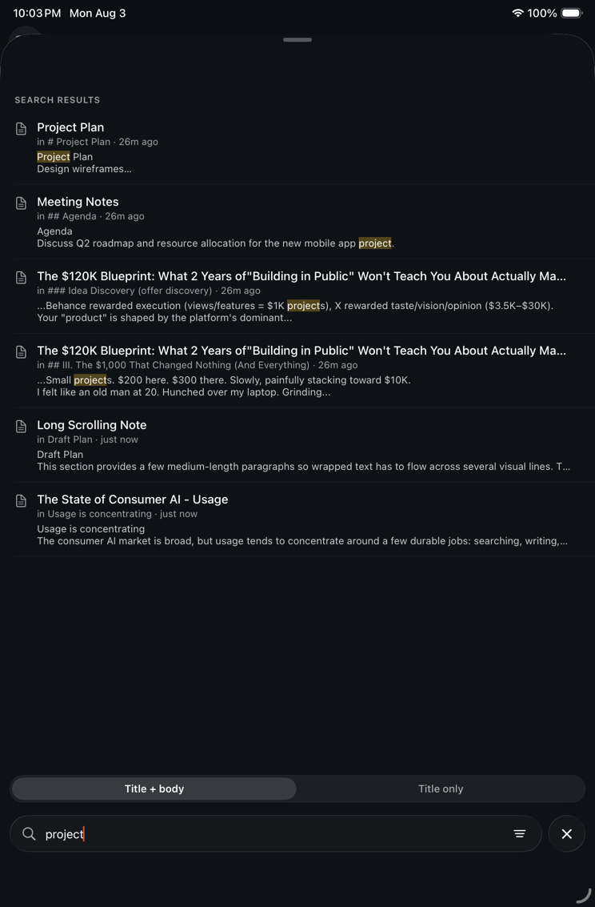

Search uses `presentationSizing(.page)` on iOS 18+, so on iPad it is a **near-full-width page
sheet** rather than iPhone's full-screen sheet. Row structure, scope control, and the dock are
unchanged.

`IPAD-10` also captures the **software keyboard raised** over the search dock — the one
keyboard-visible state in the set.

### IPAD-04 — Editor more menu

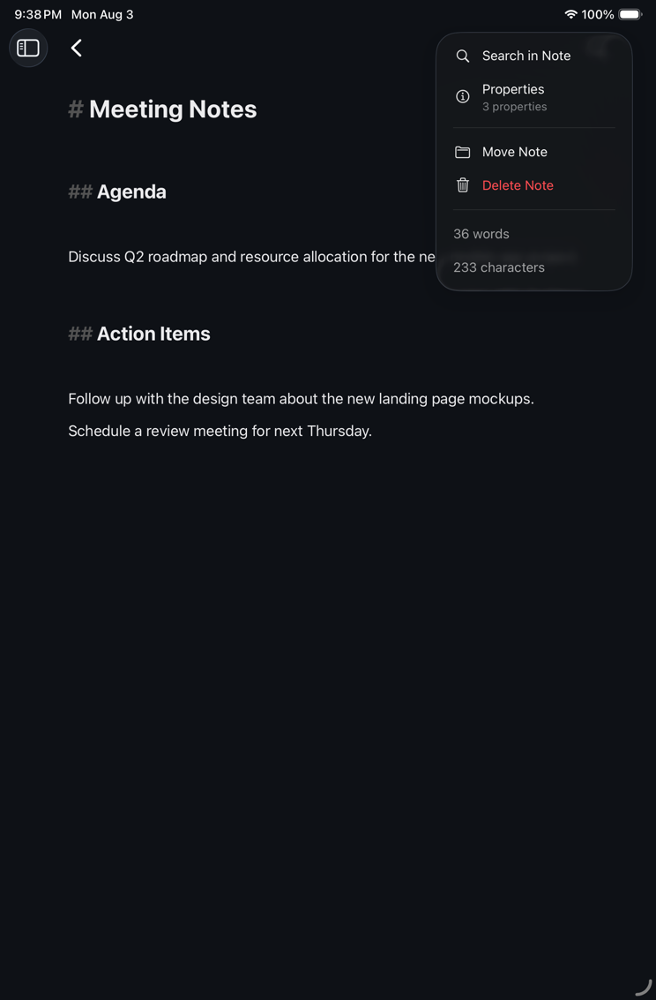

Identical items and identifiers to iPhone (`EDIT-02`), anchored as a popover from the nav-bar
⋯ rather than presented from the dock. Confirms the menu is shared between compact and regular
width — unlike the macOS menu, which is a separate implementation.

### IPAD-05 — Properties as a centred panel

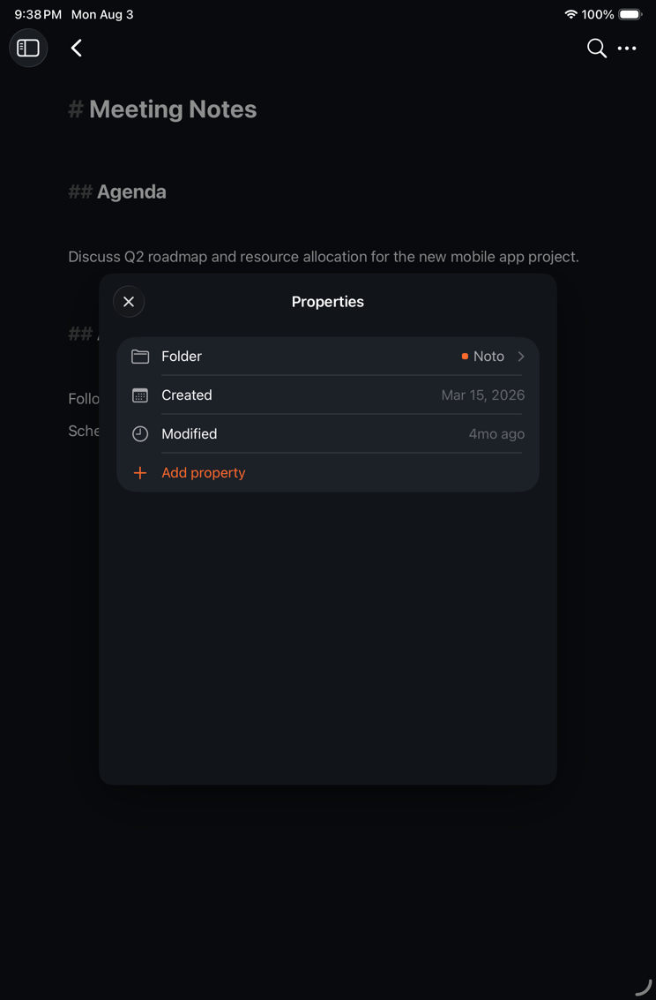

The single clearest platform delta. Where iPhone uses a native bottom sheet with
swipe-to-dismiss, iPad (regular width) uses a **centred floating card over a dimmed backdrop**,
dismissed by tapping outside. SwiftUI sheets never dismiss on an outside tap, so this is a
hand-built overlay.

### IPAD-06 — Find bar

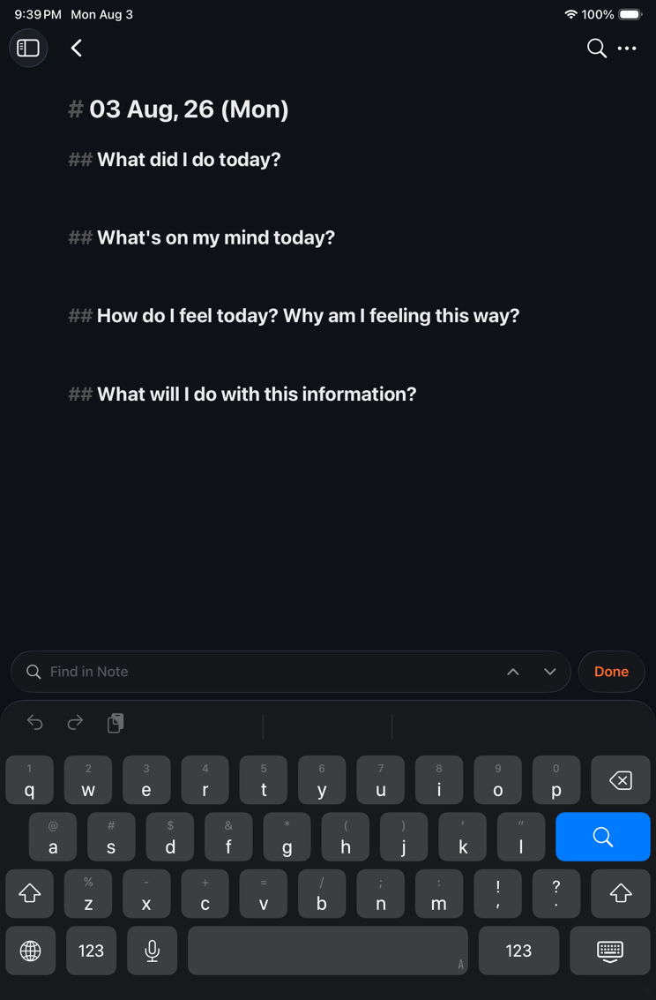

The magnifier in the iPad **editor** nav bar opens **in-note find**, not global search —
unlike the iPhone dock's Search, which opens the global sheet. Same control, different verb.

---

## 9. macOS deltas

### MAC-01 — Split window

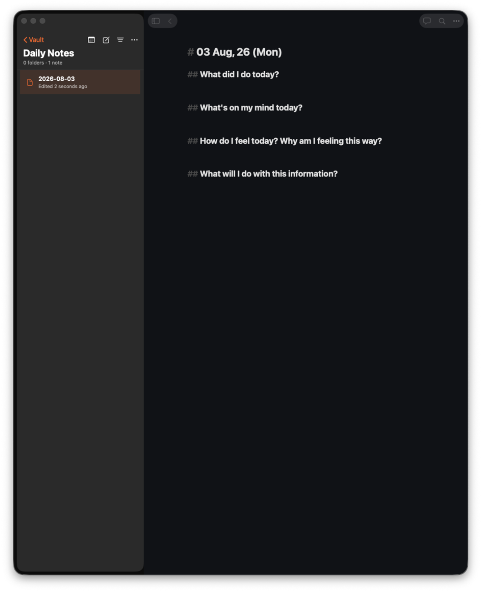

`NavigationSplitView` with a **permanent** sidebar column. Hidden title bar
(`.windowStyle(.hiddenTitleBar)`), transparent titlebar, traffic lights floating inside the
sidebar. Window background is forced to `NotoTheme.background` so the title bar matches the
editor body, and the window expands to full visible screen height on open.

### MAC-04 — Sidebar at vault root

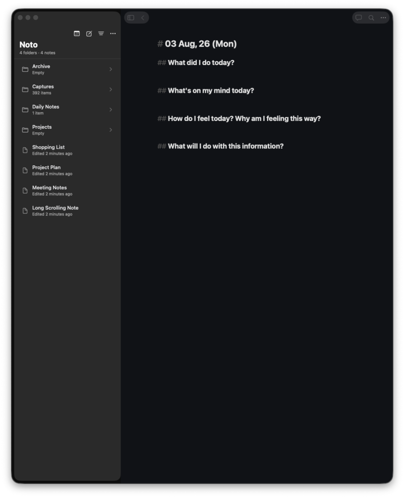

Denser rows than iOS. Sidebar header carries calendar (Today), new note, sort, and more.

> The `Captures — 392 items` count here is a Readwise-sync artifact of the capture
> environment, not app behaviour. See [README](README.md#coverage-and-gaps).

### MAC-02 — Chat as an inline column

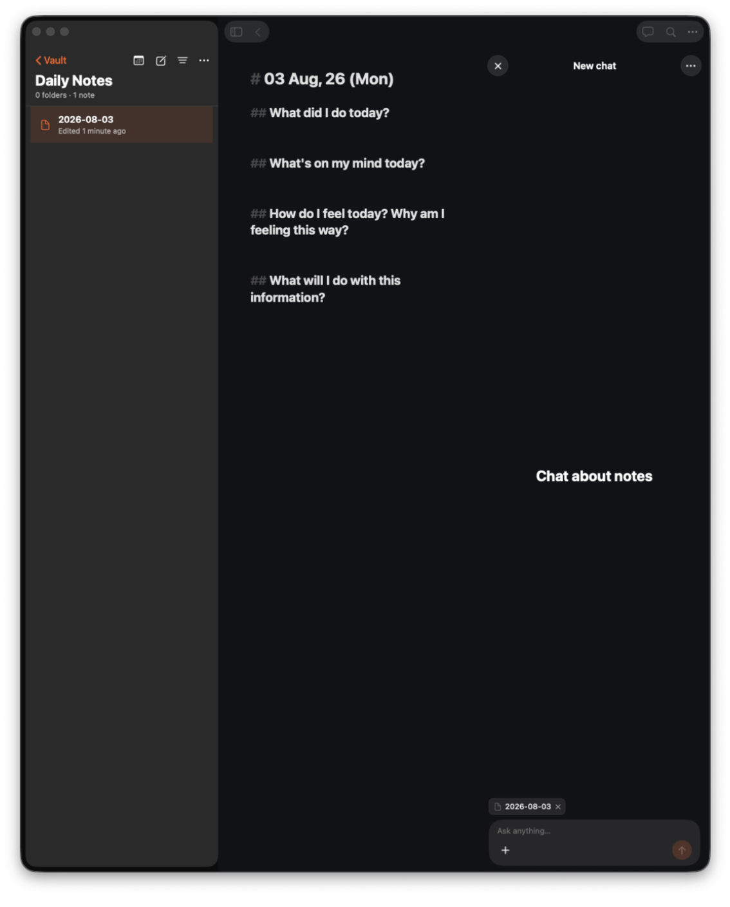

**The biggest structural delta in the app.** On iOS chat is a modal sheet; on macOS
(`macos_chat_toggle`, ⌘L) it is a **third inline column**. The editor reflows to a narrower
measure and stays fully interactive alongside the conversation.

### MAC-03 — Find bar

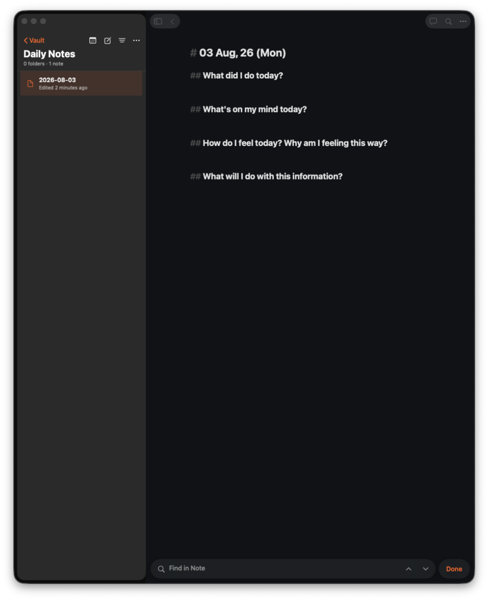

Same find bar, positioned with a fixed 12pt bottom inset (no keyboard to avoid).

### MAC-05 — Todos (fixed 2026-08-03)

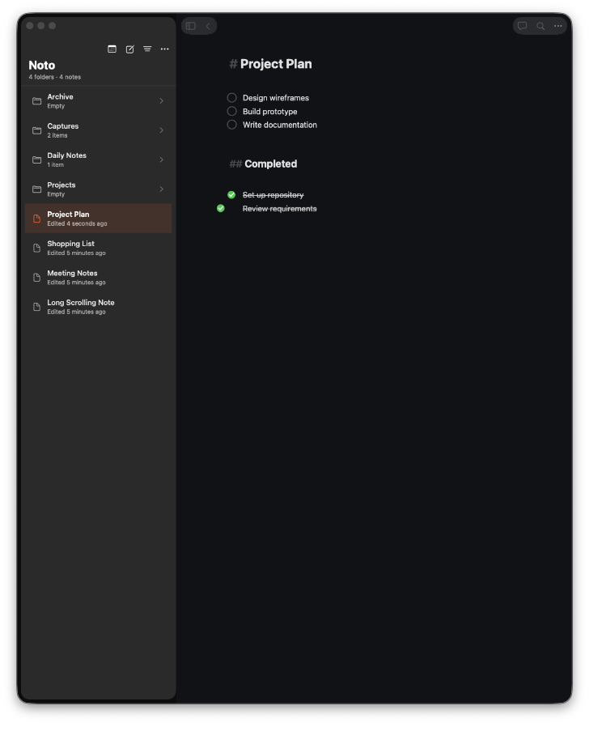

Now matches [EDIT-08](#edit-08--todos): hollow circles for open items, green filled checks with
strikethrough for completed ones.

**It did not always.** Before the fix, macOS drew no marker at all — text was indented into
empty space and completed items showed strikethrough with no check:

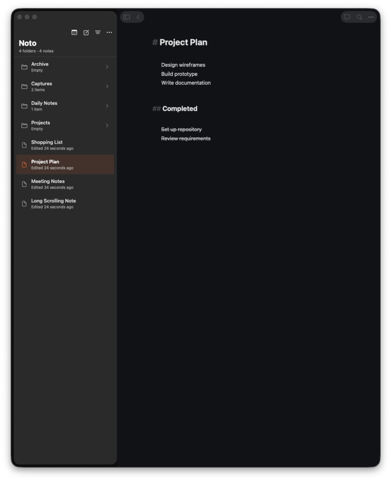

**Root cause.** `TodoLayoutFragment.draw` only called `super.draw` — it reserved horizontal
space but painted nothing. The circle and check were drawn by overlay `TodoMarkerButton` views
inside `#if os(iOS)`, so macOS never got them. Indent and strikethrough survived because they
come from paragraph styling, which is shared — which is exactly why this read as "todos look a
bit plain" rather than "todos are broken".

**Fix.** The glyph is now described once in `TodoMarkerRenderer` — pure `CGContext`, no
`#if` — and drawn from there by both the iOS overlay button and the macOS layout fragment.
`TodoLayoutFragment` also widens `renderingSurfaceBounds` to include the marker, which sits
left of the text origin and was otherwise clipped away.

Covered by `NotoTests/TodoMarkerRendererTests.swift`, which is deliberately ungated so it runs
on **both** the `Noto-iOS` and `Noto-macOS` schemes.

**One thing still unverified:** click-to-toggle on macOS. The hit-testing
(`todoMarkerHitRect` → `toggleTodoMarkerAtPoint`) already existed and derives from the same
`TodoMarkerGeometry` as the drawing, so the target should now coincide with a visible circle.
But confirming a real click needs cursor-taking GUI automation, which has not been run —
treat it as expected-to-work, not verified.

### MAC-06 — Bullets render correctly

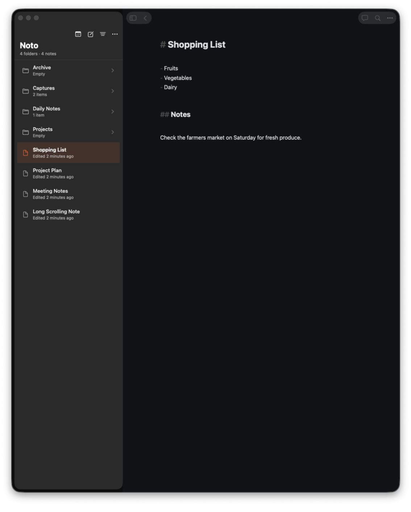

Muted `-` markers with indented text, matching iOS. The control case that proves MAC-05 is a
real defect.

### MAC-07 — Capture note: full rendering parity

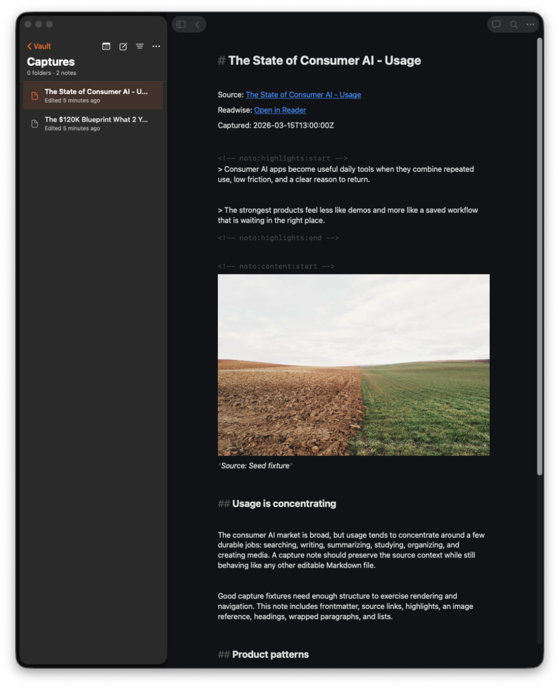

Everything else in the rich-rendering path matches iOS exactly on `NSTextView`: markdown links
as blue titles, HTML comments in muted monospace, blockquotes with literal `>`, italic caption
text, and inline images loaded from vault-relative paths. Frontmatter is hidden.

So the `NSTextView` stack is **not** broadly behind the `UITextView` one — todos are a specific,
isolated gap.

### MAC-08 — Empty folder, with different copy

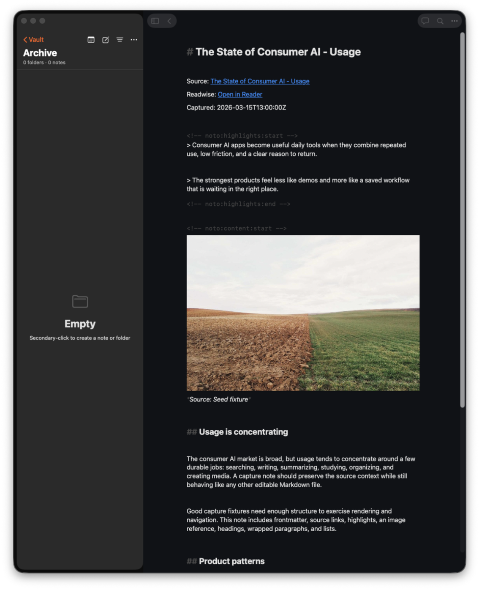

The empty state reads **"Secondary-click to create a note or folder"**, where iOS says
**"Tap + to create a note or folder"** (LIST-05). Platform-appropriate copy, and it implies a
**right-click context menu** on the sidebar that has no iOS equivalent — a surface not captured
here and worth documenting separately.

Note also that the detail pane **retains the previously open note** when you navigate the
sidebar into a different folder; selection and detail are independent. On iPhone, navigating
the list pushes and replaces.

### macOS menu bar (documented, not captured)

A `Noto` command menu:

| Command | Shortcut | Command | Shortcut |
|---|---|---|---|
| New Note | ⌘N | Toggle Sidebar | ⌘⇧B |
| New Window | ⌘⇧N | Search | ⌘K |
| Today | ⌘T | AI Chat | ⌘L |
| Search in Note | ⌘F | Bold | ⌘B |
| Move Note | ⌘⇧M | Italic | ⌘I |
| Strikethrough | ⌘⇧X | Link | ⌘⇧K |

Commands are routed by `NotificationCenter` and **filtered per window** via
`NotoCommandTarget.matches` — with several windows open, a command must act only on the key
window. Reload-from-conflict is ⌘⇧R.

Settings is a native `Settings` scene (⌘,), not a sheet.
