# Noto Architecture And Lifecycle

Snapshot date: 2026-04-27

Scope: active app code in `Noto/`, active packages in `Packages/NotoVault`, `Packages/NotoSearch`, and the Readwise sync package integration. `archive/` contains legacy experiments and is not on the active path.

## High-Level Architecture

Noto is a SwiftUI app with a file-backed markdown vault. The app shell is thin: it resolves a vault, owns a root `MarkdownNoteStore`, watches the vault for filesystem changes, starts background sync/index work, and routes into list/sidebar/editor surfaces.

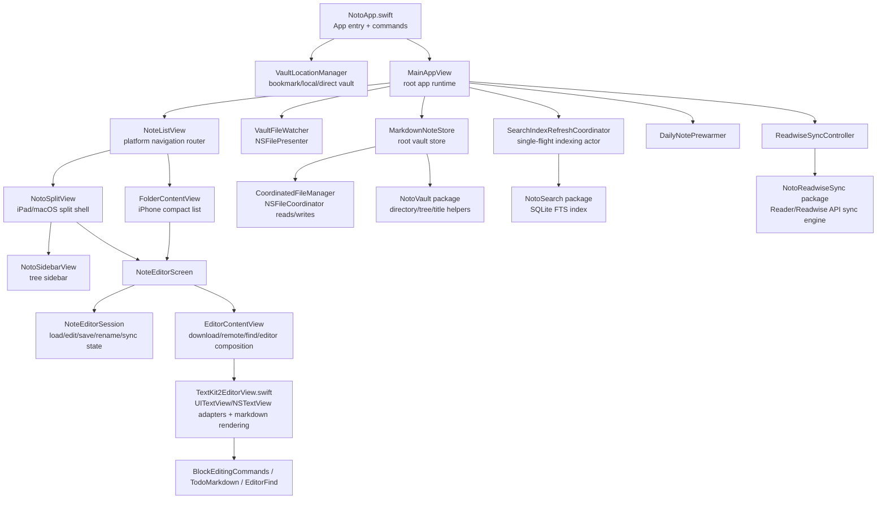

## Directory Map

- `Noto/NotoApp.swift`
  - App entry point, app commands, window setup, root dependency ownership.
  - `MainAppView` owns the root store, vault watcher, daily-note prewarmer, search-index refresh, and Readwise automatic sync.

- `Noto/Views/`
  - `VaultSetupView.swift`: first-run vault picker and macOS/iOS folder-picking UI.
  - `SettingsView.swift`: vault reset plus Readwise token/sync controls.
  - `NoteListView.swift`: platform router. iPhone compact uses `NavigationStack`; iPad/macOS use `NotoSplitView`.
  - `Shared/NotoSplitView.swift`: split-view shell, sidebar/detail composition, note history, global search presentation.
  - `Shared/NotoSidebarView.swift`: shared sidebar tree with expansion state, selection, creation, deletion, and sidebar filtering.
  - `NoteEditorScreen.swift`: editor screen owner; creates the session, chrome, find state, word count, delete flow, sync notifications.
  - `Shared/EditorContentView.swift`: download/error/content switch, remote update banner, find bar, and `TextKit2EditorView`.
  - `iOS/IOSEditorNavigationChrome.swift` and `macOS/MacEditorNavigationChrome.swift`: platform chrome around the same editor core.

- `Noto/Editor/`
  - `TextKit2EditorView.swift`: live iOS/iPadOS/macOS editor path. Contains shared markdown semantics plus platform TextKit adapters.
  - `NoteEditorSession.swift`: load/save/autosave/rename/conflict state machine.
  - `BlockEditingCommands.swift`: pure markdown text transforms for todo, indent/outdent, inline marks, hyperlinks, images, page mentions.
  - `TodoMarkdown.swift`: todo-line parsing and checkbox toggling.
  - `EditorFind.swift`: find matcher and navigation model.
  - `BlockEditorView*` and `Block.swift`: legacy/alternate block editor code; current live editor is `TextKit2EditorView`.

- `Noto/Storage/`
  - `MarkdownNoteStore.swift`: main app-facing store for notes/folders. File-backed, main-actor observable, delegates listing to `NotoVault`.
  - `CoordinatedFileManager.swift`: all coordinated reads/writes/moves/deletes and iCloud availability helpers.
  - `VaultLocationManager.swift`: vault persistence, bookmarks, local vault, direct vault, launch-argument test hooks.
  - `VaultFileWatcher.swift`: `NSFilePresenter` wrapper that debounces external changes.
  - `NoteTemplate.swift`: daily-note template.

- `Noto/Support/`
  - `NoteSyncCenter.swift`: same-process note-save notification bus between open editor sessions/windows.
  - `DebugTrace.swift`: lightweight runtime trace log.
  - `AppTheme.swift`: shared colors and theme primitives.

- `Noto/SearchIndexRefreshCoordinator.swift`
  - Actor that single-flights full index refreshes, debounces file refreshes, and posts `.notoSearchIndexDidChange`.

- `Noto/Sync/`
  - `ReadwiseSyncController.swift`: app-level token state and sync task orchestration.
  - `ReadwiseSecretStore.swift`: secure token storage and bundled token plumbing.

- `Packages/NotoVault/`
  - Platform-neutral vault listing and metadata helpers.
  - `VaultDirectoryLoader`: one-directory folder/note listing, ordering, metadata strategy.
  - `SidebarTreeLoader`: recursive tree rows, expansion filtering, sidebar search filtering.
  - `NoteTitleResolver`, `Frontmatter`, `WordCounter`, `VaultManager`, `NoteFile`: domain helpers.

- `Packages/NotoSearch/`
  - Platform-neutral search indexing and query layer.
  - `MarkdownSearchIndexer`: scans vault markdown files, refreshes changed files, refreshes/removes single files.
  - `MarkdownSearchDocumentExtractor`: markdown/frontmatter/heading/section/plaintext extraction.
  - `SearchIndexStore`: SQLite/FTS store.
  - `MarkdownSearchEngine`: query normalization and search facade.
  - `SearchTypes`: documents, sections, stats, results.

- `Packages/NotoReadwiseSync/`
  - Readwise/Reader import logic. The app calls this via `PackageReadwiseSyncRunner`.

## Ownership Model

- `NotoApp` owns app-global state:
  - `VaultLocationManager`
  - `ReadwiseSyncController`

- `MainAppView` owns per-vault runtime state:
  - root `MarkdownNoteStore`
  - one `VaultFileWatcher`
  - one `DailyNotePrewarmer`
  - search-index refresh kickoff
  - automatic Readwise sync kickoff

- Navigation views own selection state:
  - Compact iPhone: `NavigationPath` of `NoteRoute`, plus `NoteNavigationHistory`.
  - iPad/macOS split: `selectedNote`, `selectedNoteStore`, `selectedIsNew`, plus history in `NotoSplitView`.
  - iPad detail additionally mirrors selected notes into a native `NavigationStack` through `NoteStackNavigationState`.

- Each editor screen owns one `NoteEditorSession`.
  - The session is the source of truth for loaded content, pending edits, autosave, rename, conflicts, download state, and delete state.
  - The TextKit view owns platform text view mechanics and calls the session via `onTextChange`.

## App Lifecycle

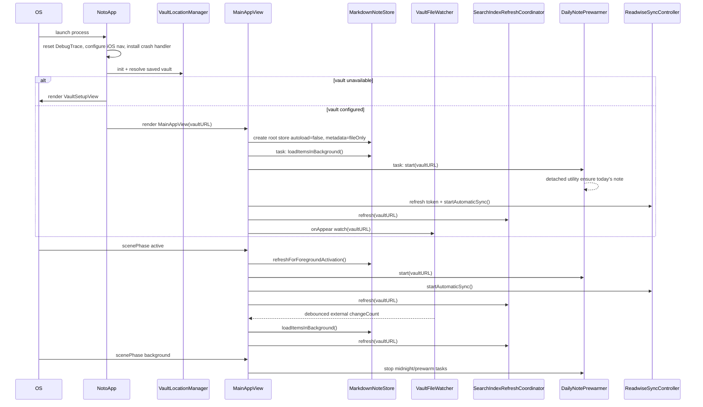

## Vault Setup Lifecycle

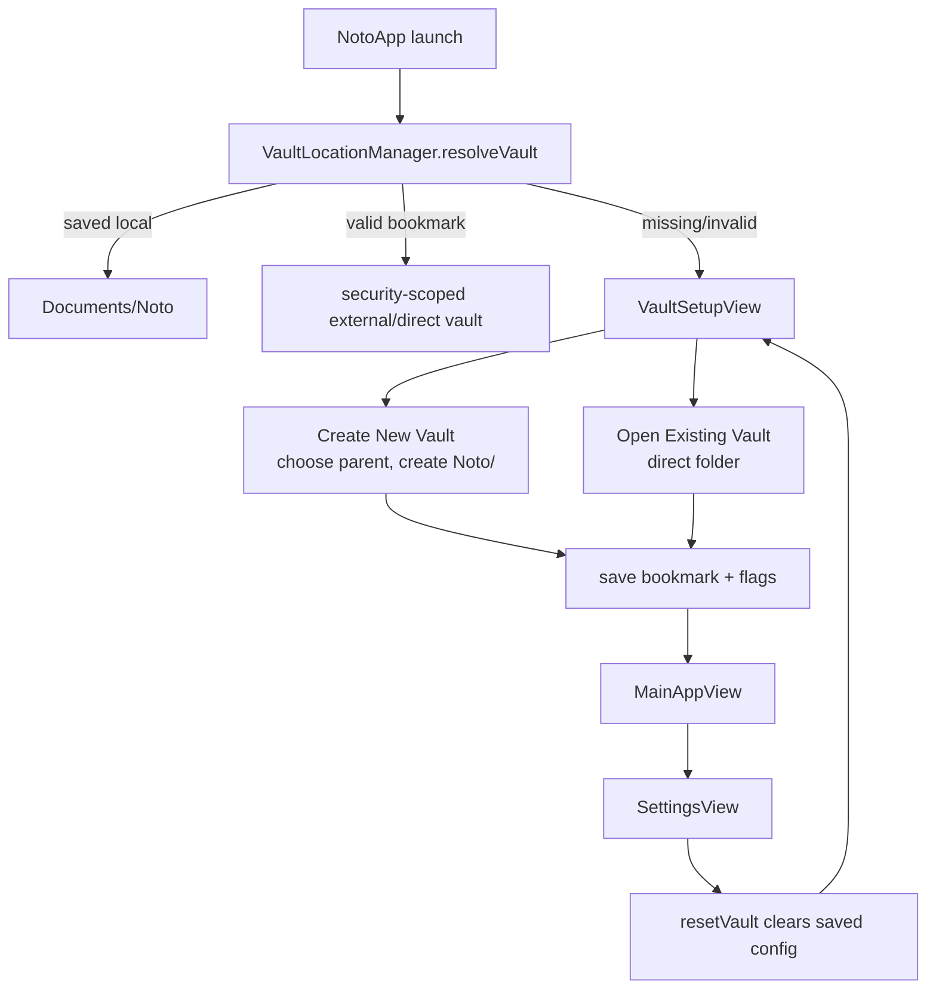

## List, Sidebar, And Navigation Lifecycle

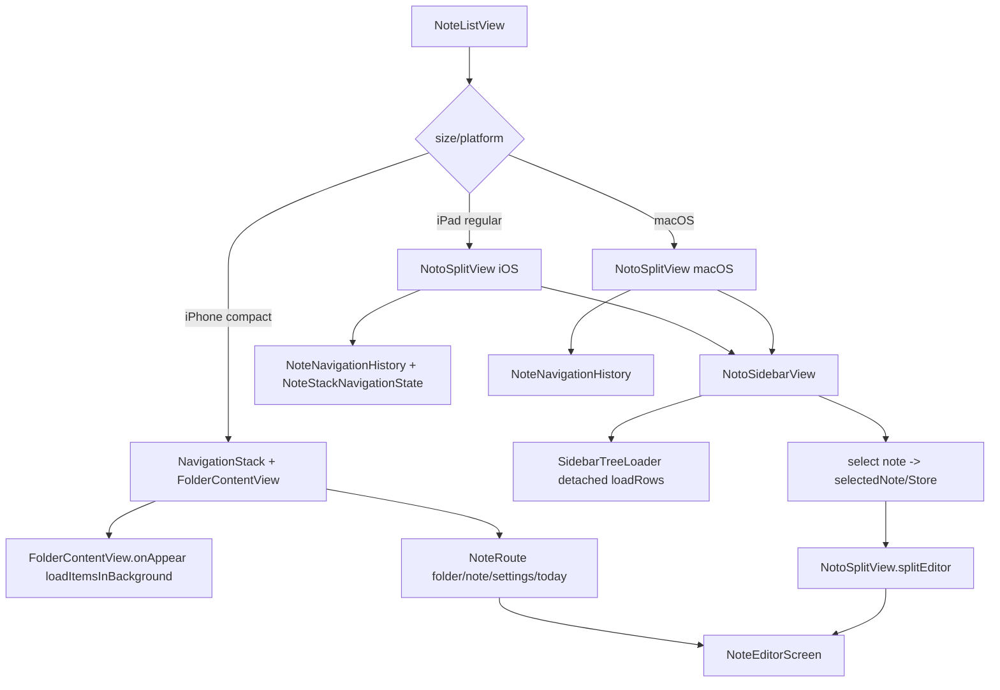

Notes:

- `MarkdownNoteStore.loadItemsInBackground()` is the standard directory-load path for responsive list/sidebar rendering.
- Root launch uses `VaultDirectoryLoader(noteMetadataStrategy: .fileOnly)` to avoid reading every note at startup.
- `NotoSidebarView` owns persisted expanded-folder URLs in `UserDefaults`, reloads tree rows off-main, and reloads searchable rows only when sidebar filtering is active.
- Compact iPhone routes notes through `NoteRoute`; split views keep selection bindings and route detail composition through `NotoSplitView`.

## Opening A Note Lifecycle

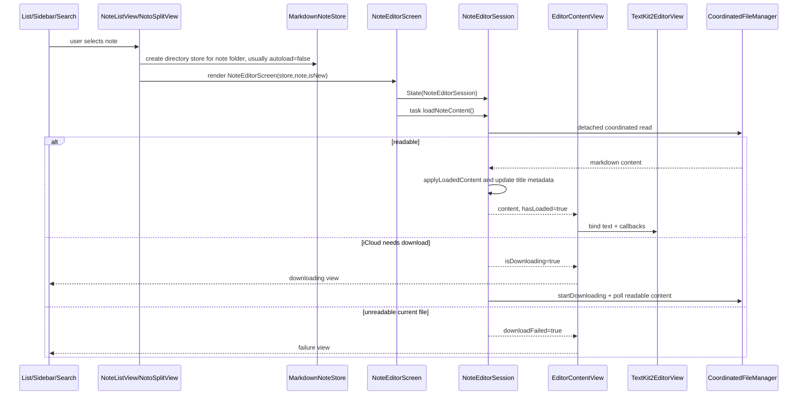

## Editing And Saving Lifecycle

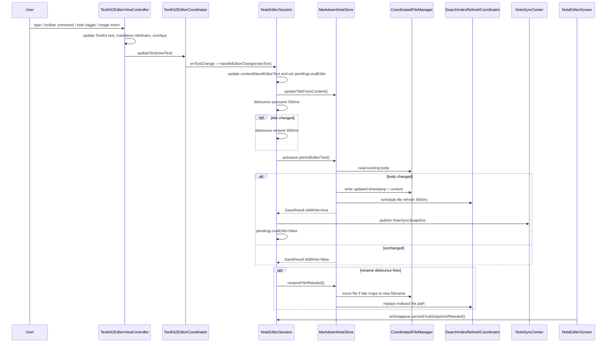

Important save semantics:

- Saves compare non-frontmatter body content first; unchanged body does not update timestamps.
- Autosave is debounced. Disappear forces a final save if latest editor text diverges from persisted text.
- Same-process synchronization is notification-based through `NoteSyncCenter`, not `VaultFileWatcher`.
- `VaultFileWatcher` is for filesystem/external changes and list/index refreshes.

## External Change And Same-Process Sync Lifecycle

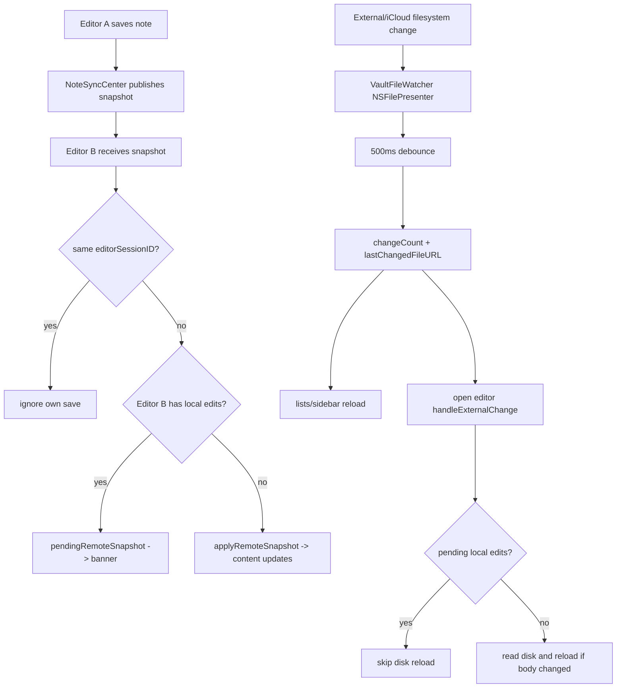

## Daily Note Lifecycle

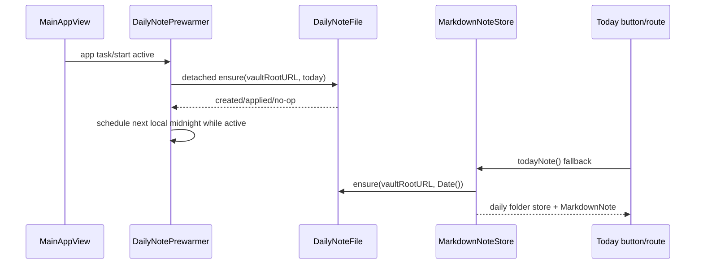

The prewarmer makes first open usually instant, but `todayNote()` remains the correctness fallback when the app was killed/suspended or the prewarm did not complete.

## Mention Menu Lifecycle

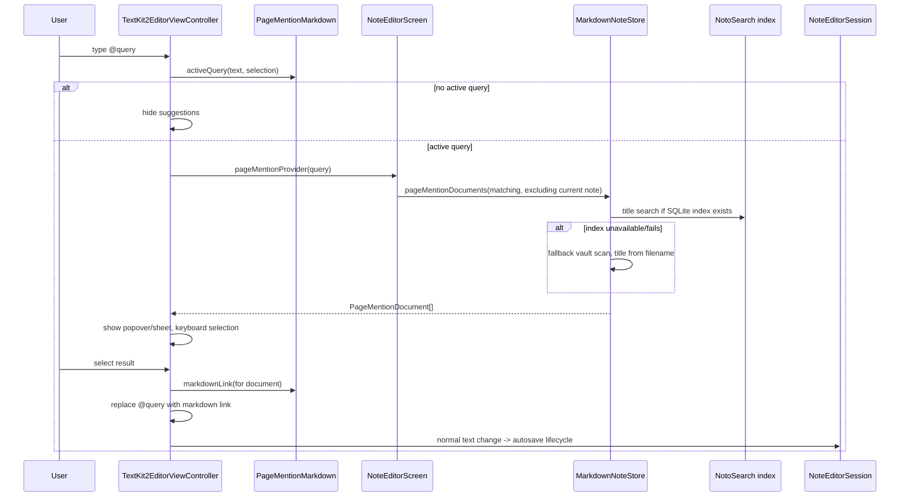

Platform notes:

- iOS has both inline suggestion popover support and a sheet path for compact/editor conditions.
- macOS uses an `NSStackView` popover anchored to the text layout.
- Page mentions currently search titles, prefer the SQLite index when available, and exclude the active note.

## Global Search Sheet Lifecycle

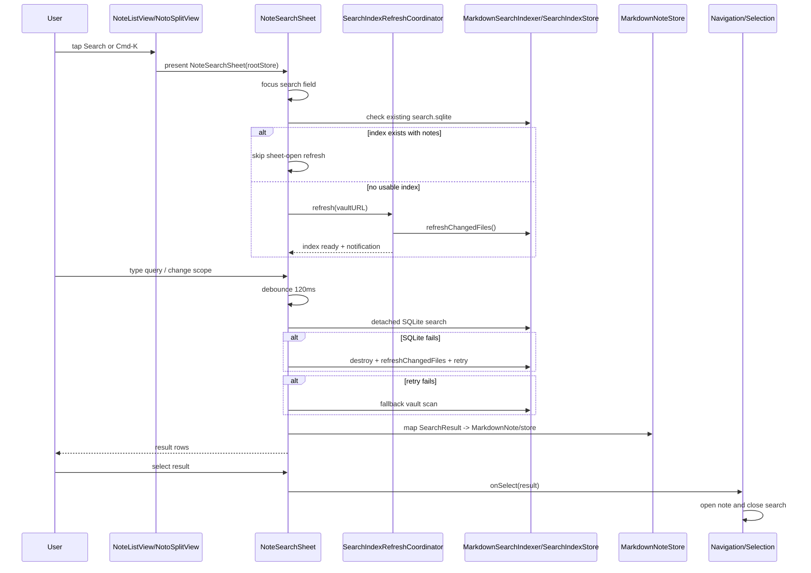

Search index refresh sources:

- `MainAppView.task` and scene active refresh.
- `VaultFileWatcher` change events.
- `MarkdownNoteStore` create/save/rename/move/delete single-file operations.
- `NoteSearchSheet.prepareIndex()` when no existing index is present.
- `DailyNotePrewarmer` and `todayNote()` when daily note creation/template application changes a file.

## Find-In-Note Lifecycle

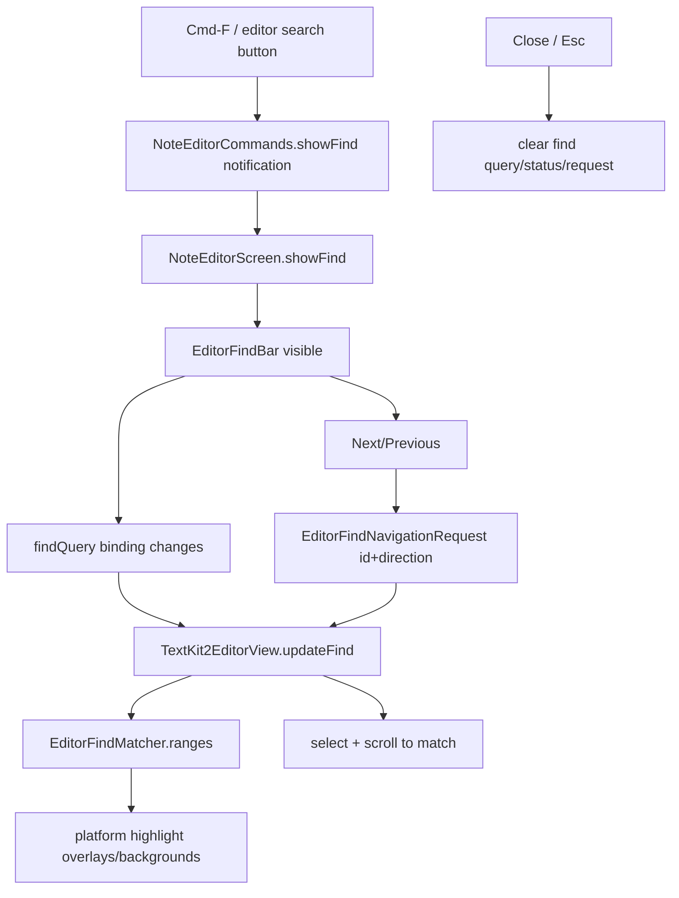

## TextKit Editor Internal Architecture

`TextKit2EditorView.swift` is intentionally dense. It has three layers in one file:

1. Shared markdown model and style layer:
   - `MarkdownBlockKind`, `MarkdownSemanticAnalyzer`, `MarkdownRenderableBlock`
   - `MarkdownFrontmatter`, `MarkdownLineRanges`, `MarkdownVisualSpec`, `MarkdownTheme`
   - `MarkdownParagraphStyler`, `MarkdownTypingAttributes`
   - hyperlink, divider, image-link, XML-like tag, todo geometry helpers

2. TextKit layout layer:
   - `MarkdownTextDelegate`
   - custom `NSTextParagraph`
   - custom layout fragments for hidden frontmatter, todos, image previews
   - image dimension/cache/loader

3. Platform adapters:
   - iOS: `UIViewControllerRepresentable`, `UITextView`, input accessory toolbar, PHPicker, keyboard avoidance.
   - macOS: `NSViewControllerRepresentable`, `NSTextView`, drop/import support, command notification observers.

Both adapters feed text changes through `TextKit2EditorCoordinator`, then into `NoteEditorSession`.

## Current Architectural Pressure Points

- `TextKit2EditorView.swift` is the largest concentration of behavior: parsing, styling, layout fragments, platform adapters, page mentions, image previews, find, hyperlinks, todo overlays, and keyboard/scroll behavior all live together.
- `NoteListView.swift` owns several concerns at once: routing, compact list UI, bottom toolbar, search sheet, and search execution/fallback logic.
- `MarkdownNoteStore.swift` is both persistence facade and app-domain service: CRUD, daily note creation, image attachments, mention lookup, index updates, and file resolution.
- The code already has good package seams for `NotoVault` and `NotoSearch`; more logic could move there when it is platform-neutral and does not depend on SwiftUI/TextKit.

## Practical Mental Model

- App lifecycle starts in `NotoApp` and `MainAppView`.
- Vault state lives in `VaultLocationManager`; vault file operations go through `MarkdownNoteStore` and `CoordinatedFileManager`.
- Navigation state lives in `NoteListView`/`NotoSplitView`.
- Directory/tree state comes from `MarkdownNoteStore` plus `NotoVault`.
- Editor document state lives in `NoteEditorSession`.
- Text rendering and editor interaction live in `TextKit2EditorView`.
- Search indexing/querying lives in `NotoSearch`, coordinated by `SearchIndexRefreshCoordinator`.
- Same-process note sync uses `NoteSyncCenter`; external filesystem sync uses `VaultFileWatcher`.
